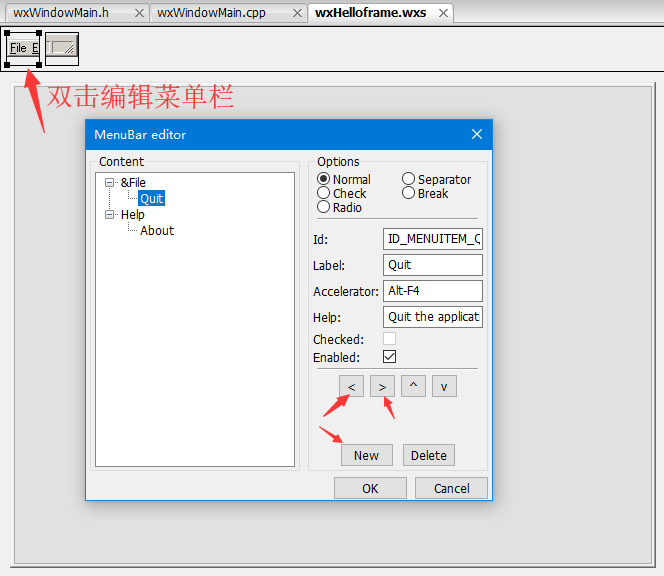
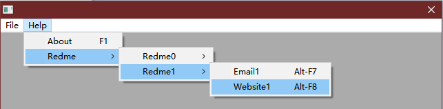
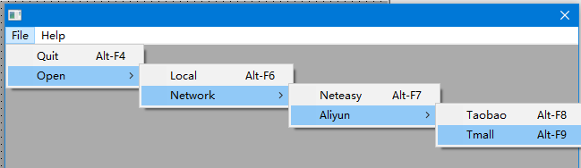
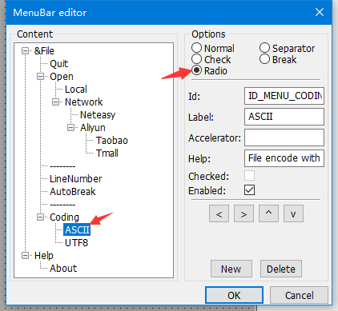
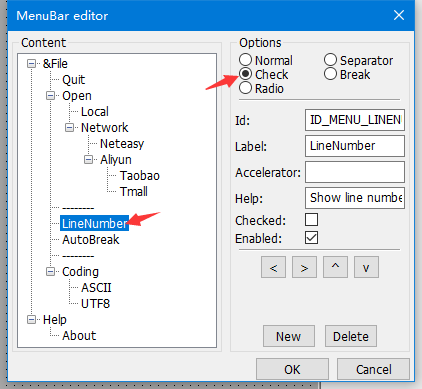
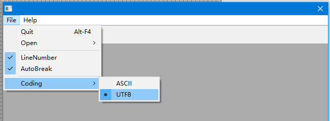
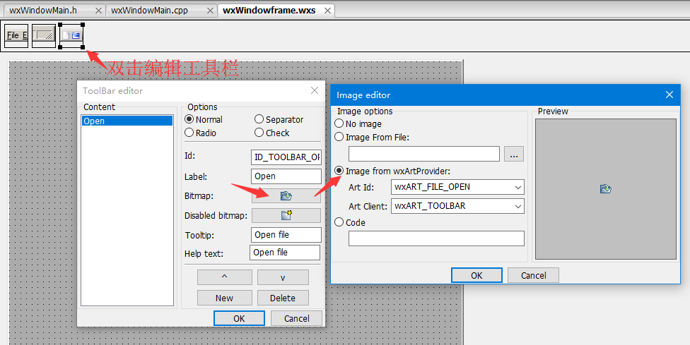

# 双击编辑菜单栏



# 多级菜单






# 多功能菜单







# 双击编辑工具栏




# 示例代码

```cpp
wxWindowFrame::wxWindowFrame(wxWindow* parent,wxWindowID id)
{
    //(*Initialize(wxWindowFrame)
    wxMenu* MenuFile;
    wxMenu* MenuHelp;
    wxMenuBar* MenuBar;
    wxMenuItem* MenuItemAbout;
    wxMenuItem* MenuItemQuit;

    Create(parent, wxID_ANY, wxEmptyString, wxDefaultPosition, wxDefaultSize, wxCAPTION|wxSYSTEM_MENU|wxCLOSE_BOX|wxNO_BORDER|wxCLIP_CHILDREN, _T("wxID_ANY"));
    SetClientSize(wxSize(640,640));
    MenuBar = new wxMenuBar();
    MenuFile = new wxMenu();
    //退出菜单
    MenuItemQuit = new wxMenuItem(MenuFile, ID_MENUITEM1, _("Quit\tAlt-F4"), _("Quit the application"), wxITEM_NORMAL);
    MenuFile->Append(MenuItemQuit);
    //打开菜单
    MenuItemOpen = new wxMenu();
    //打开子菜单
    MenuItemLocal = new wxMenuItem(MenuItemOpen, ID_MENU_OPEN_LOCAL, _("Local\tAlt-F6"), _("Open file or project from local"), wxITEM_NORMAL);
    MenuItemOpen->Append(MenuItemLocal);
    //网络打开子菜单
    MenuItemNetwork = new wxMenu();
    MenuItemNeteasy = new wxMenuItem(MenuItemNetwork, ID_MENU_OPEN_NET163, _("Neteasy\tAlt-F7"), _("Open file or project from 163.com"), wxITEM_NORMAL);
    MenuItemNetwork->Append(MenuItemNeteasy);
    //网络打开子菜单
    MenuItemAliyun = new wxMenu();
    MenuItemTaobao = new wxMenuItem(MenuItemAliyun, ID_MENU_OPEN_NETALI_TAOBAO, _("Taobao\tAlt-F8"), _("Open file or project from taobao.com"), wxITEM_NORMAL);
    MenuItemAliyun->Append(MenuItemTaobao);
    MenuItemTmall = new wxMenuItem(MenuItemAliyun, ID_MENU_OPEN_NETALI_TMALL, _("Tmall\tAlt-F9"), _("Open file or project from tmall.com"), wxITEM_NORMAL);
    MenuItemAliyun->Append(MenuItemTmall);
    
    MenuItemNetwork->Append(ID_MENU_OPEN_NETALIYUN, _("Aliyun"), MenuItemAliyun, _("Open file or project from aliyun"));
    
    MenuItemOpen->Append(ID_MENU_OPEN_NET, _("Network"), MenuItemNetwork, _("Open file or project from network"));
    
    MenuFile->Append(ID_MENU_OPEN, _("Open"), MenuItemOpen, _("Open file or project"));
    //分隔符
    MenuFile->AppendSeparator();
    //显示行号
    MenuItemLineNumber = new wxMenuItem(MenuFile, ID_MENU_LINENUMBER, _("LineNumber"), _("Show line number"), wxITEM_CHECK);
    MenuFile->Append(MenuItemLineNumber);
    //自动换行
    MenuItemAutoBreak = new wxMenuItem(MenuFile, ID_MENU_LINEBREAK, _("AutoBreak"), _("Auto line break"), wxITEM_CHECK);
    MenuFile->Append(MenuItemAutoBreak);
    //分隔符
    MenuFile->AppendSeparator();
    //文件编码
    MenuItemCoding = new wxMenu();
    MenuItemAscii = new wxMenuItem(MenuItemCoding, ID_MENU_CODING_ASCII, _("ASCII"), _("File encode with ascii"), wxITEM_RADIO);
    MenuItemCoding->Append(MenuItemAscii);
    MenuItemUtf8 = new wxMenuItem(MenuItemCoding, ID_MENU_CODING_UTF8, _("UTF8"), _("File encode with utf-8"), wxITEM_RADIO);
    MenuItemCoding->Append(MenuItemUtf8);
    MenuFile->Append(ID_MENU_CODING, _("Coding"), MenuItemCoding, _("File encoding"));
    
    MenuBar->Append(MenuFile, _("&File"));
    
    //帮助菜单
    MenuHelp = new wxMenu();
    MenuItemAbout = new wxMenuItem(MenuHelp, ID_MENU_ABOUT, _("About\tF1"), _("Show info about this application"), wxITEM_NORMAL);
    MenuHelp->Append(MenuItemAbout);
    MenuBar->Append(MenuHelp, _("Help"));
    
    SetMenuBar(MenuBar);
    
    //状态栏
    StatusBar = new wxStatusBar(this, ID_STATUSBAR, 0, _T("ID_STATUSBAR"));
    int __wxStatusBarWidths_1[1] = { -1 };
    int __wxStatusBarStyles_1[1] = { wxSB_NORMAL };
    StatusBar->SetFieldsCount(1,__wxStatusBarWidths_1);
    StatusBar->SetStatusStyles(1,__wxStatusBarStyles_1);
    SetStatusBar(StatusBar);
    
    //工具栏
    ToolBar = new wxToolBar(this, ID_TOOLBAR, wxDefaultPosition, wxDefaultSize, wxTB_HORIZONTAL|wxNO_BORDER, _T("ID_TOOLBAR"));
    ToolBarItemOpen = ToolBar->AddTool(ID_TOOLBAR_OPEN, _("Open"), wxArtProvider::GetBitmap(wxART_MAKE_ART_ID_FROM_STR(_T("wxART_FILE_OPEN")),wxART_TOOLBAR), wxArtProvider::GetBitmap(wxART_MAKE_ART_ID_FROM_STR(_T("wxART_NEW_DIR")),wxART_TOOLBAR), wxITEM_NORMAL, _("Open file"), _("Open file"));
    ToolBar->Realize();
    SetToolBar(ToolBar);
    Center();

    //动态事件绑定
    Connect(ID_MENUITEM1,wxEVT_COMMAND_MENU_SELECTED,(wxObjectEventFunction)&wxWindowFrame::OnQuit);
    Connect(ID_MENU_ABOUT,wxEVT_COMMAND_MENU_SELECTED,(wxObjectEventFunction)&wxWindowFrame::OnAbout);
    //*)
}
```

